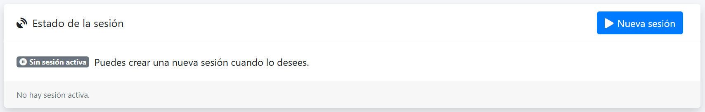
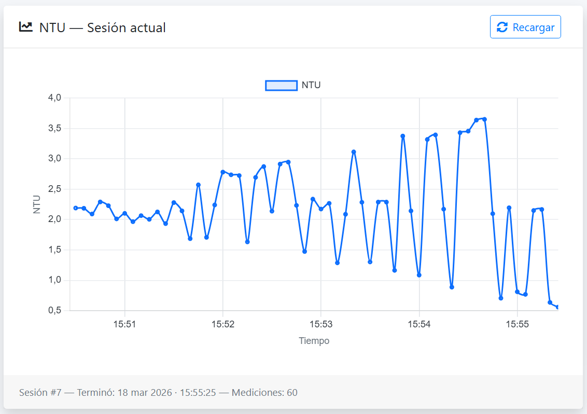
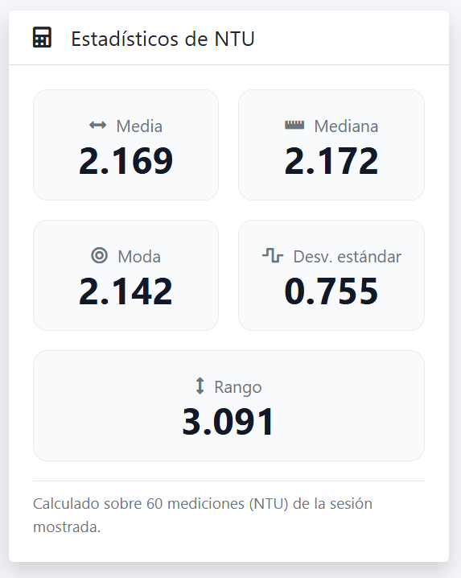

# info_sensor_turbidez

Academic project focused on the web integration and persistence of turbidity measurements captured by an ESP32 device.  
The system allows measurement session creation, device authentication through token-based access, and a simple localhost-based protection mechanism for restricted routes.  
It was built as a laboratory prototype to validate Wi-Fi communication between an ESP32 and a web backend for turbidity data transfer, not as a production-ready system.

## Table of Contents
- [Features](#features)
- [Tech Stack](#tech-stack)
- [Project Structure](#project-structure)
- [How to Run](#how-to-run)
- [Environment Variables](#environment-variables)
- [Usage](#usage)
- [API Endpoints](#api-endpoints)
- [Screenshots or Evidence](#screenshots-or-evidence)
- [Notes](#notes)
- [Limitations](#limitations)
- [Status](#status)
- [Author](#author)
- [License](#license)

## Features
- ESP32 polling flow through `GET /command` to detect whether an active measurement session exists.
- Session-based turbidity data ingestion through `POST /session/reading`.
- Token authentication for the ESP32 device.
- Basic localhost-only protection for restricted routes on the web side.
- Current session and historical session visualization in the frontend.
- On-demand calculation of statistical metrics for each session:
  - Mean
  - Mode
  - Median
  - Standard deviation
  - Range
- Python-based ESP32 simulator to test the system without physical hardware.
- Support for both real ESP32 testing and simulated device testing.

## Tech Stack

**Backend**
- PHP
- PDO (Singleton pattern)
- REST API architecture
- MVC-inspired folder organization

**Frontend**
- HTML
- CSS
- JavaScript
- Chart.js

**Database**
- MySQL

**Libraries / Services**
- XAMPP
- phpMyAdmin

**Tools**
- Python
- C++ (ESP32 firmware)

## Project Structure
- `api/`: Backend API organized with routes, controllers, models, middleware, config, and services.
- `api/config/`: Database configuration and application-level settings.
- `api/controllers/`: Request handling logic for sessions, readings, and related operations.
- `api/middleware/`: Access protection logic, including token validation and localhost-based route restrictions.
- `api/models/`: Data access layer for database interaction.
- `api/routes/`: API endpoint definitions.
- `api/services/`: Helper logic such as date/time handling and session expiration support.
- `db/`: SQL scripts required to create and seed the database.
- `frontend/`: Client-side application with pages, assets, scripts, styles, rendering logic, and request handling.
- `tools/`: ESP32 firmware source code and Python-based ESP32 simulator for testing.
- `README.md`: Project documentation.

## How to Run

### Prerequisites
- XAMPP with **Apache** and **MySQL** running correctly
- Python installed
- A local environment capable of serving PHP projects through `htdocs`

**Optional for hardware testing**
- An ESP32 board
- Arduino IDE or another compatible IDE to upload the firmware

### 1. Clone the repository
```bash
git clone https://github.com/XxMigue03xX/info_sensor_turbidez.git
cd info_sensor_turbidez
````

### 2. Place the project inside XAMPP `htdocs`

Move or clone the repository into your XAMPP web root, usually:

```bash
C:\xampp\htdocs\info_sensor_turbidez
```

### 3. Start Apache and MySQL

Open XAMPP Control Panel and start:

* Apache
* MySQL

### 4. Set up the database

Open **phpMyAdmin** and execute the SQL scripts from the `db/` folder.

First, run the script that creates the database structure.

Then, update the device token inside the device seed SQL file before executing it.

The project expects a valid **48-character hexadecimal token** for the ESP32 device.

Example token format:

```txt
a3f91c6de84b7f12aa34bc56de78ff90123456789abcdeff
```

You can generate one with:

**PHP**

```bash
php -r "echo bin2hex(random_bytes(24)), PHP_EOL;"
```

**Python**

```bash
python -c "import secrets; print(secrets.token_hex(24))"
```

After generating the token:

1. Replace the placeholder token in device.sql.
2. Execute that SQL file in phpMyAdmin.

### 5. Review database configuration

This project does not use `.env` files.

Database access must be configured directly in:

```txt
/api/config/config.php
```

Default values:

```php
const DB_HOST = '127.0.0.1';
const DB_NAME = 'iot';
const DB_USER = 'root';
const DB_PASS = '';
const DB_CHARSET = 'utf8mb4';
```

The provided SQL files are designed to create the database with the expected name.

### 6. Open the frontend

Once Apache and MySQL are running and the database is ready, open:

```txt
http://localhost/info_sensor_turbidez/frontend/index.html
```

### 7. Run the ESP32 simulator (recommended for local testing)

Open a terminal inside the `tools` folder:

```bash
cd tools
python ESP32_sim.py --base http://localhost/info_sensor_turbidez/api --token <your_token> --mode real --poll 3
```

Or use fast mode:

```bash
python ESP32_sim.py --base http://localhost/info_sensor_turbidez/api --token <your_token> --mode fast
```

Check the initial comment inside the Python simulator for more usage details.

### 8. Create a new session

When the simulator console shows:

```txt
[SIM] /command -> {'command': 'idle'}
```

go to the frontend and click **"Nueva sesión"**.

### 9. Wait for the session to finish

* In **real mode**, the process takes about 5 minutes.
* In **fast mode**, readings are posted almost immediately with aligned timestamps.

### 10. Refresh and verify results

After the session is completed:

* Refresh the frontend
* Review the current or last session data
* Review historical sessions
* Optionally inspect the database using phpMyAdmin

---

### Alternative: run with a real ESP32

Steps 1 to 6 remain the same.

Then:

1. Connect the ESP32 to your computer.
2. Upload the ESP32 firmware from `tools/` using Arduino IDE or your preferred IDE.
3. Verify the board is running correctly.
4. Create a new session from the frontend.
5. Wait approximately 5 minutes.
6. Refresh the frontend and/or inspect the database.

## Environment Variables

This project does not use environment variables. Configuration is done directly in `api/config/config.php`.

```env
DB_HOST=127.0.0.1
DB_NAME=iot
DB_USER=root
DB_PASS=
DB_CHARSET=utf8mb4
```

## Usage

1. Start the backend and database locally using XAMPP.
2. Run either the real ESP32 firmware or the Python simulator.
3. Wait until the device is polling `GET /command` and receives `idle`.
4. Create a new session from the frontend.
5. The device will detect the active session and start sending readings.
6. Each reading is sent to `POST /session/reading` with:

   * `session_id`
   * `seq`
   * `device_epoch_ms`
   * `ntu`
   * `raw_mv`
7. The device repeats the cycle until:

   * 60 readings are completed, or
   * the session expires
8. Once finished, the device waits before returning to the polling loop.
9. Review the results in the current session view or in the session history section.

## API Endpoints

| Method | Endpoint           | Description                                                                                  |
| ------ | ------------------ | -------------------------------------------------------------------------------------------- |
| GET    | `/command`         | Returns whether the device should stay idle or start sending readings for an active session. |
| POST   | `/session/reading` | Receives one turbidity reading associated with an active session.                            |
| GET    | `/session`         | Returns all sessions data with calculated statistics on demand.                                   |
| GET    | `/session/:id`     | Returns a specific session and its calculated metrics.                                       |
| GET    | `/session/last`    | Returns the latest session with its calculated metrics.                                      |

> Full endpoint details are available in the Postman documentation for the project.

## Screenshots or Evidence

* API documentation: [Postman Collection](https://documenter.getpostman.com/view/28246198/2sBXihqYSJ)

### New Session
Shows the main session section in the frontend, including the **"Nueva sesión"** button used to start a new turbidity measurement cycle.



### Current Session Graph
Displays the chart for the current or latest session, allowing visualization of turbidity readings over time.



### Calculated Metrics
Shows the calculated statistics for a completed session, including values such as mean, median, mode, standard deviation, and range.



## Notes

* This repository was built as an **academic project** and proof of concept.
* Its goal was to validate ESP32-to-web communication over Wi-Fi for turbidity measurement transfer.
* It was **not designed for production use**.
* Statistical metrics are **not stored in the database**; they are calculated on demand when requesting session data.
* Authentication and route protection were intentionally simplified because a full user management system was outside the scope of the project.
* There is currently **no active deployment**, although deployment may be considered in the future.

## Limitations

* No full user authentication or role system.
* Restricted route protection is based on localhost assumptions, which is acceptable only for local academic usage.
* No environment variable management.
* No production deployment configuration.
* No automated test suite.
* Session statistics are computed on demand instead of being persisted.
* The project was created as a laboratory validation prototype rather than as a hardened production system.

## Status

Completed academic project, preserved as a portfolio repository.

## Author

**Miguel Garavito**

* Portfolio: [miguelgaravito.netlify.app](https://miguelgaravito.netlify.app/)
* LinkedIn: [linkedin.com/in/miguel-ángel-garavito-camargo](https://co.linkedin.com/in/miguel-%C3%A1ngel-garavito-camargo)

## License

This project is shared for educational and portfolio purposes.